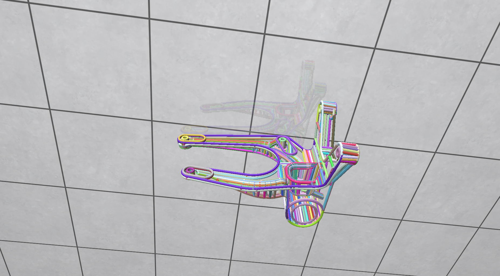
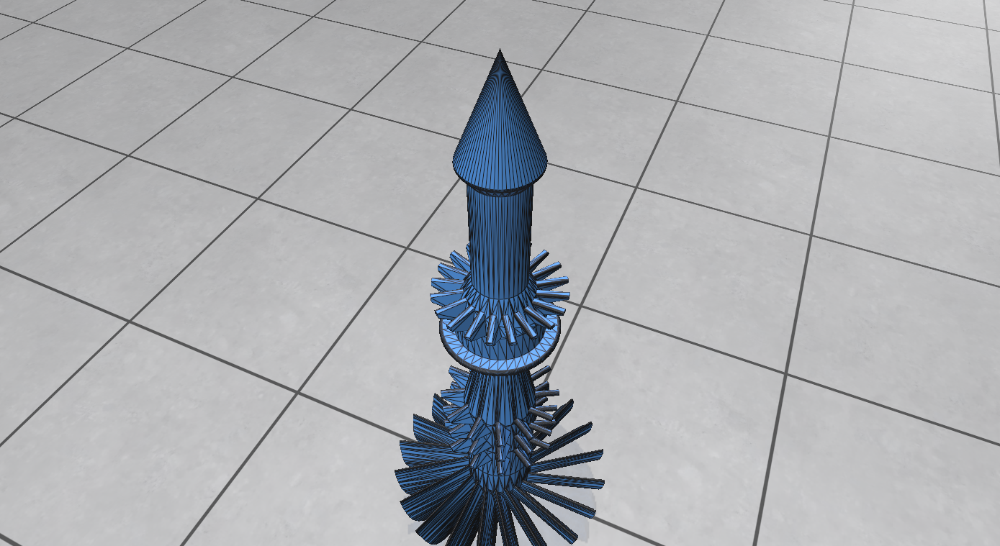

Nastran to Json Converter
=========================

A simple code that helps convert Nastran meshes to a JSON file format that is more
suitable for the current day and age.

Currently it reads the following data from Nastran file (.nas)

* Vertices
* Triangles
* Feature edges (Indicated using BLSEG)

There is also a python script called `visualize_features.py`

It can be used to visualize the feature lines in [Polyscope](https://polyscope.run)

or the surface mesh or both

It also adds an unique random colour automatically to every feature group indicated as `BLSEG`